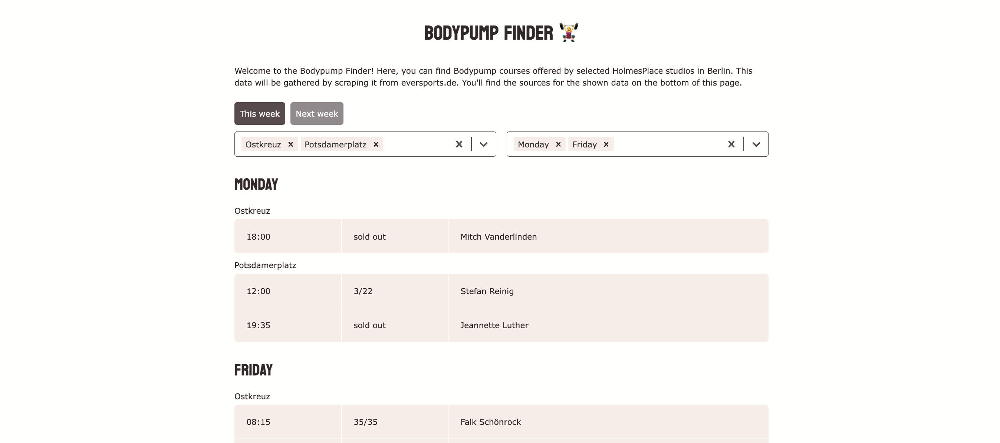

# Bodypump Finder 🏋️‍♀️

## Overview

This web application is designed to streamline the process of finding Les Mills Bodypump courses offered at various Holmes Place studios in Berlin. Instead of manually checking multiple studio websites, this application consolidates the information into one convenient platform.

## Features

- **Data Source:** The application scrapes data from eversports.de to ensure the most up-to-date course information.
- **Filtering:** Easily filter Bodypump courses by location and day.
- **Caching:** Caches courses for 15 minutes and the sources for one day.

## Technologies Used

- **Frontend:** React, Typescript
- **Backend:** Node.js
- **Web Scraping:** Axios, Cheerio
- **Framework:** Express.js

## Deployment on Render

This application is deployed on Render for easy access. You can access the live version of the application [here](https://bodypump-finder-ui.onrender.com/). Please note that it is deployed on the free instance type, which spins down after 15 minutes without receiving inbound traffic. In such cases, it takes 1-2 minutes to spin back up.

## Getting Started

1. Clone the Repository: `git clone git@github.com:luisaberlin/bodypump-finder.git`

### Backend

2. Navigate into the backend-folder
3. Install Dependencies: `yarn install`
4. Run the Application: `yarn start:dev`

### Frontend

5. Navigate into the frontend-folder
6. Install Dependencies: `yarn install`
7. Run the Application: `yarn serve:dev`
8. Open in Browser and navigate to http://localhost:5173/ to access the application.
